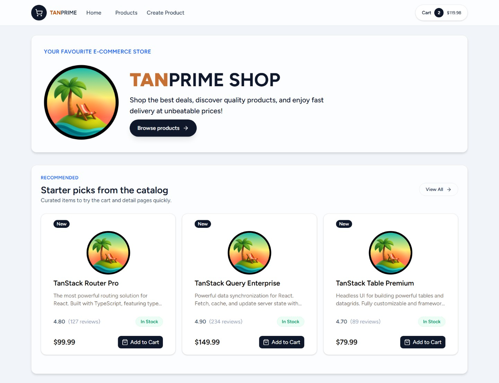

# TAN-PRIEM SHOP (TanStack Start App)

A modern e-commerce platform built with TanStack Start. Fast, type-safe, and ready for production.

TanStack Start is a full-stack React framework that provides server-side rendering, static site generation, and API routes with unparalleled type safety. It combines the best of React with the power of TanStack Router and TanStack Query for a seamless developer experience.

<p align="center">
  
</p>

## What's Inside

- **Shopping Features**: Product catalog, cart management, inventory tracking, product recommendations
- **Modern Stack**: TanStack Start + Router + Query, PostgreSQL with Drizzle, ShadCN UI, TailwindCSS 4
- **Full-Stack React**: Server-side rendering, type-safe routing, server functions

```bash
# Create a new TanStack project
npm create @tanstack/start@latest
```

<br/>

## Quick Start

```bash
# Clone your fork
git clone https://github.com/your-username/tanpriem-shop.git
cd tanpriem-shop

# Install dependencies
npm install

# Set up database
# Create a .env file with DATABASE_URL=postgresql://...
npm run db:migrate
npm run db:seed

# Start development server
npm run dev
```

Visit `http://localhost:3000` to see the app.

## Project Structure

```
src/
├── components/     # React components
│   ├── cart/      # Cart-related components
│   └── ui/        # ShadCN UI components
├── data/          # Data access layer
├── db/            # Database schema and connection
├── lib/           # Utilities
├── routes/        # File-based routes
└── types/         # TypeScript definitions
```

## Available Scripts

| Command               | Description                     |
| --------------------- | ------------------------------- |
| `npm run dev`         | Start dev server on port 3000   |
| `npm run build`       | Build for production            |
| `npm run preview`     | Preview production build        |
| `npm run db:generate` | Generate database migrations    |
| `npm run db:migrate`  | Run database migrations         |
| `npm run db:push`     | Push schema changes to database |
| `npm run db:studio`   | Open Drizzle Studio             |
| `npm run db:seed`     | Seed database with sample data  |
| `npm run test`        | Run tests with Vitest           |
| `npm run lint`        | Run ESLint                      |
| `npm run format`      | Format code with Prettier       |
| `npm run check`       | Format and lint code            |

## Tech Stack

### Core Dependencies

- **Framework**: TanStack Start with React 19
- **Routing**: TanStack Router + DevTools
- **Data Fetching**: TanStack Query + Form
- **Database**: PostgreSQL with Drizzle ORM + Drizzle Kit
- **UI Components**:
  - Base UI React
  - Radix UI + Slot
  - ShadCN UI
  - Lucide React
  - Huge Icons
- **Styling**: TailwindCSS 4 + Vite plugin
- **Icons**: Huge Icons Core Free

### Development Dependencies

- **Build Tool**: Vite + Plugins
- **Type Safety**: TypeScript
- **Testing**: Vitest + Testing Library
- **Code Quality**:
  - TanStack ESLint Config
  - Prettier
- **Utilities**:
  - tsx for running TypeScript scripts
  - clsx + tailwind-merge for class management
  - Zod for validation

### Key Integrations

- **Appwrite**: Backend integration
- **PostgreSQL**: Database drivers (pg + postgres)
- **Fonts**: Figtree Variable font
- **Animations**: tw-animate-css

<br/>

---

## 📌 TanStack Start Highlights

Welcome to your new TanStack Start app!

### Getting Started

To run this application:

```bash
npm install
npm run dev
```

### Building For Production

To build this application for production:

```bash
npm run build
```

### Testing

This project uses [Vitest](https://vitest.dev/) for testing. You can run the tests with:

```bash
npm run test
```

### Styling

This project uses [Tailwind CSS](https://tailwindcss.com/) for styling.

#### Removing Tailwind CSS

If you prefer not to use Tailwind CSS:

1. Remove the demo pages in `src/routes/demo/`
2. Replace the Tailwind import in `src/styles.css` with your own styles
3. Remove `tailwindcss()` from the plugins array in `vite.config.ts`
4. Uninstall the packages: `npm install @tailwindcss/vite tailwindcss -D`

### Routing

This project uses [TanStack Router](https://tanstack.com/router) with file-based routing. Routes are managed as files in `src/routes`.

#### Adding A Route

To add a new route to your application just add a new file in the `./src/routes` directory.

TanStack will automatically generate the content of the route file for you.

Now that you have two routes you can use a `Link` component to navigate between them.

#### Adding Links

To use SPA (Single Page Application) navigation you will need to import the `Link` component from `@tanstack/react-router`.

```tsx
import { Link } from '@tanstack/react-router';
```

Then anywhere in your JSX you can use it like so:

```tsx
<Link to="/about">About</Link>
```

This will create a link that will navigate to the `/about` route.

More information on the `Link` component can be found in the [Link documentation](https://tanstack.com/router/v1/docs/framework/react/api/router/linkComponent).

#### Using A Layout

In the File Based Routing setup the layout is located in `src/routes/__root.tsx`. Anything you add to the root route will appear in all the routes. The route content will appear in the JSX where you render `{children}` in the `shellComponent`.

Here is an example layout that includes a header:

```tsx
import { HeadContent, Scripts, createRootRoute } from '@tanstack/react-router';

export const Route = createRootRoute({
  head: () => ({
    meta: [
      { charSet: 'utf-8' },
      { name: 'viewport', content: 'width=device-width, initial-scale=1' },
      { title: 'My App' },
    ],
  }),
  shellComponent: ({ children }) => (
    <html lang="en">
      <head>
        <HeadContent />
      </head>
      <body>
        <header>
          <nav>
            <Link to="/">Home</Link>
            <Link to="/about">About</Link>
          </nav>
        </header>
        {children}
        <Scripts />
      </body>
    </html>
  ),
});
```

More information on layouts can be found in the [Layouts documentation](https://tanstack.com/router/latest/docs/framework/react/guide/routing-concepts#layouts).

### Server Functions

TanStack Start provides server functions that allow you to write server-side code that seamlessly integrates with your client components.

```tsx
import { createServerFn } from '@tanstack/react-start';

const getServerTime = createServerFn({
  method: 'GET',
}).handler(async () => {
  return new Date().toISOString();
});

// Use in a component
function MyComponent() {
  const [time, setTime] = useState('');

  useEffect(() => {
    getServerTime().then(setTime);
  }, []);

  return <div>Server time: {time}</div>;
}
```

### API Routes

You can create API routes by using the `server` property in your route definitions:

```tsx
import { createFileRoute } from '@tanstack/react-router';
import { json } from '@tanstack/react-start';

export const Route = createFileRoute('/api/hello')({
  server: {
    handlers: {
      GET: () => json({ message: 'Hello, World!' }),
    },
  },
});
```

### Data Fetching

There are multiple ways to fetch data in your application. You can use TanStack Query to fetch data from a server. But you can also use the `loader` functionality built into TanStack Router to load the data for a route before it's rendered.

For example:

```tsx
import { createFileRoute } from '@tanstack/react-router';

export const Route = createFileRoute('/people')({
  loader: async () => {
    const response = await fetch('https://swapi.dev/api/people');
    return response.json();
  },
  component: PeopleComponent,
});

function PeopleComponent() {
  const data = Route.useLoaderData();
  return (
    <ul>
      {data.results.map((person) => (
        <li key={person.name}>{person.name}</li>
      ))}
    </ul>
  );
}
```

Loaders simplify your data fetching logic dramatically. Check out more information in the [Loader documentation](https://tanstack.com/router/latest/docs/framework/react/guide/data-loading#loader-parameters).
